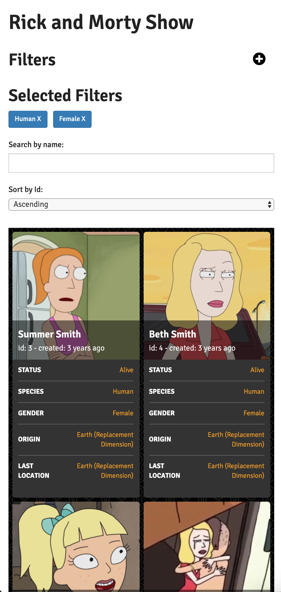
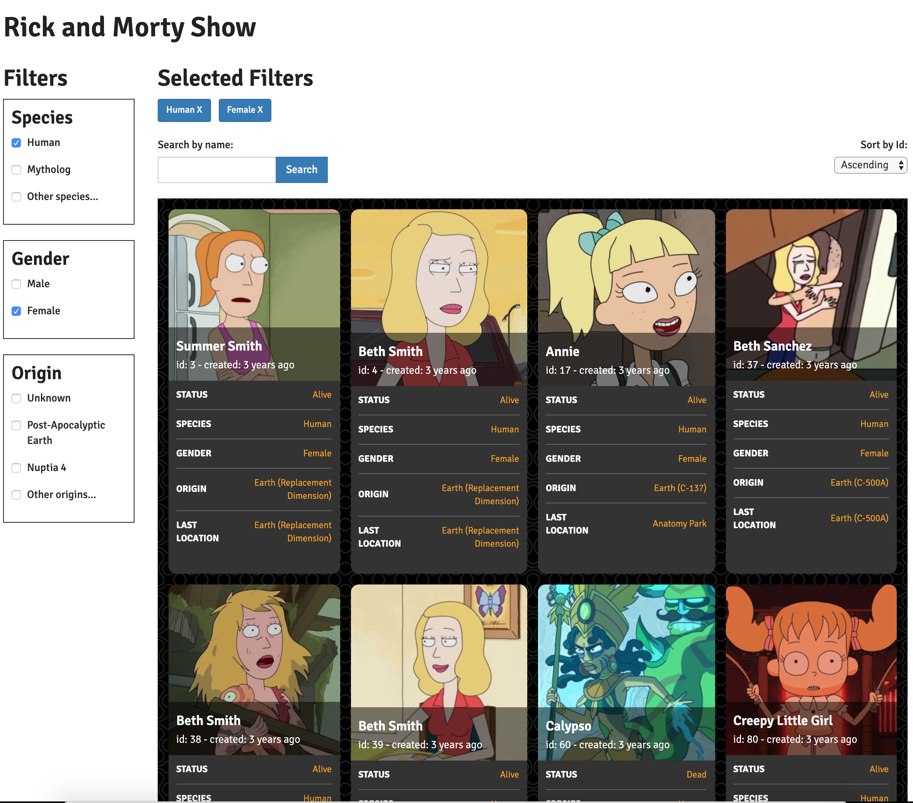
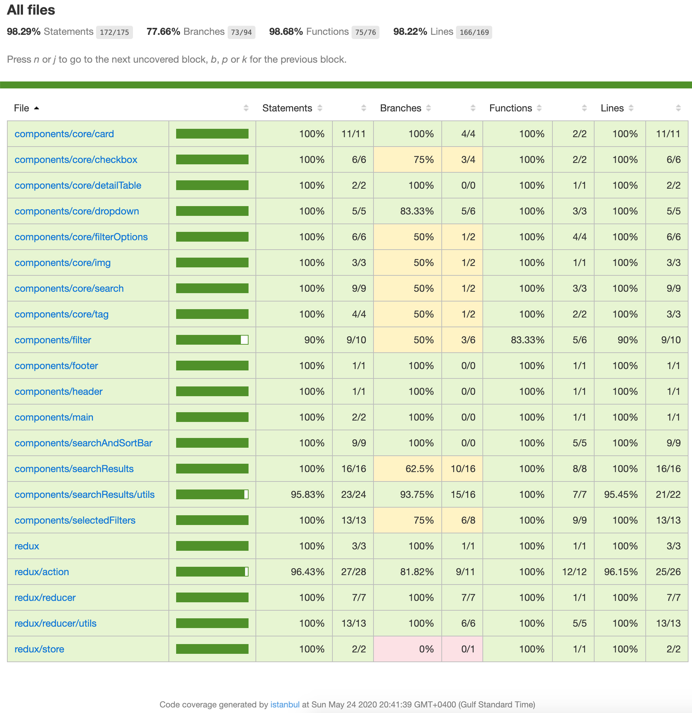

# Rick and Morty Characters
Application is build to provide users with Characters list from their favorite comedy show rick and Morty.

## Features
- Server side rendering
- Filter based on options
- search by name starting with (ignore cases)
- Sorting by id (Ascending and Descending)

## Tools
- Next JS (webpack, babel are builtin, but customizable)
- React
- Jest
- Enzyme

## Running Application
- Use development mode via ```npm run dev```
- To create production ready code use ```npm run build```
- To run already created production ready code use command ```npm run start```
- To test code coverage use command ```npm run test:cover```


## Attribution is being given to:
- ```https://fontawesome.com/``` for free SVG icons
- ```http://subtlepatterns.com``` for patterns
- ```bootstrap for custom css```

## App view
| Small  | Large |
:--------------:|:-----------------:
 |  


## coverage


## What's Next
checkout [todo.md](todo.md)
